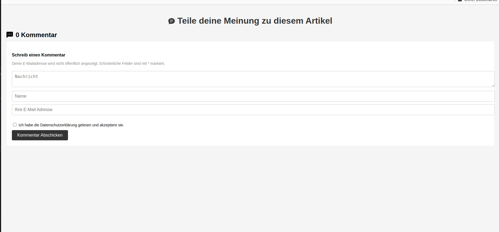

# Kommentar App

[Kommentar-App](https://comment-app-iota.vercel.app/)

Dies ist ein kleines Projekt, das es den Benutzern ermöglicht, ihre Meinung zu einem Artikel zu teilen. Es bietet eine Kommentarliste und ein Kommentarformular.

## Screenshot

## Funktionen

- Benutzer können ihren Namen, ihre E-Mail-Adresse und ihre Nachricht eingeben, um einen Kommentar abzugeben.
- Die Kommentare werden in der Kommentarliste angezeigt, einschließlich des Namens, des Datums und der Nachricht.
- Benutzer können Kommentare löschen, indem sie auf die "Delete" Schaltfläche klicken.

## Technologien

- React
- Javascript
- HTML
- CSS

## Autor
- Leotrim Behrami - [Github-Profil](https://github.com/Leotrimbehrami)